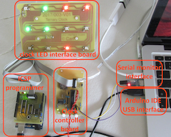

# :clock10: µ-controller based Ternary clock with colorful read-out

## What

At school, kids learn to count from 1 to 10 (probably because of the number of fingers on your hands ;-). As such, in daily life, the decimal system is by far the most popular, and most intuitive to use. Computer scientists tend to prefer [binary](https://en.wikipedia.org/wiki/Binary_number) (0-1) or [hexadecimal](https://en.wikipedia.org/wiki/Hexadecimal) (x0-xF) systems. All of them are just a way of representing quantity (or whatever info you want) in a non-ambiguous way.

In a [ternary or base-3 systems](https://en.wikipedia.org/wiki/Ternary_numeral_system), only 0,1 and 2 are used. Being way less common, reading figures like 12201211 might make your brain-processor to get hot. The µ-controller driven clock in this repository is based on the ternary numeral system.

A web-version is already available in a [related repository](https://github.com/nostradomus/Base3-clock-webversion). In order to see a fully functional demo, click on [this link to our server](http://nostradomus.ddns.net/clock.html).

## Why

Some might find the idea a little crazy, others will say its fun. I think it is an excellent tool to train the brain... and I am probably having a twisted mind :laughing:

Anyhow, after having played around with javascript and css for the [web-version](https://github.com/nostradomus/Base3-clock-webversion), a new challenge popped up. I felt the need for a massive stand-alone living-room version.

## How

A first brainstorm session has resulted in a pretty complete [mindmap](docs/project-mindmap.mm) in the [docs folder](docs/).

Next, a breadboard prototype was build to test the feasibility of the concept. The LED's have been fit in an air-wire frame. Off-the-shelve modules (power supply, Arduino Nano and RTC) have been connected on a breadboard to develop the first version of the application. The LED colors have been carefully chosen by using the [analogue slider panel](https://github.com/nostradomus/LabTools_Analogue-input-slider-panel) from our **LabTools collection**.

After having finished the software development on the breadboard version, dedicated pcb's have been designed for the project :
- [RGB LED interface board](#rgb-led-interface-board)
- [µ-Controller board](#µ-controller-board)
- [stand-alone RTC module](#rtc-module) with square wave output option

The first pcb prototype has been assembled, to serve as a model for the final design of the [plexi lasercut-files](laser-cutting-files/) for the housing.

 

## Progress status

 - [x] have a [crazy idea](#why)
 - [x] write the [functional specifications](#how)
 - [x] build an air-wire/breadboard [prototype](#how)
 - [x] design the final [electronics](#electronics)
 - [x] build a proof-of-concept for the final [electronics](#electronics)
 - [x] write [code for the µ-controller](#µ-controller-code) respecting best-practices
 - [ ] design and build a [state-of-the-art housing](#mechanical-construction)
 - [ ] write an [end-user manual](https://github.com/nostradomus/Base3-clock/wiki)

## Technical details

### How to read this clock

Each line or column (depending on how you mount the clock) represents a part of the time :

line | description | values
-----|-------------|-------
1 | hours | 00-23
2 | minutes | 00-59
3 | seconds | 00-59

Each element of the line represents one base-3 digit, with a different color for each possible value :
 - 0 : `light off`
 - 1 : `green`
 - 2 : `red`

In a horizontal configuration, the numbers should be read from right to left.

The rightmost element is the least significant trit (yes trit, not bit).

The leftmost element is the most significant trit.

### The Maths, a bit of theory...

The same way binary or decimal numeral systems are based on powers of their respective radices 2 and 10, the **ternary** system is based on powers of `3`.

trit    | least significant |       |        |         |          | ... | most significant
--------|-------------------|-------|--------|---------|----------|-----|-----------------
power   | 0                 | 1     | 2      | 3       | 4        | ... |
decimal | 1                 | 3     | 9      | 27      | 81       | ... |
range   | 0/1/2             | 0/3/6 | 0/9/18 | 0/27/54 | 0/81/162 | ... |

So to convert a ternary number to the decimal system, you have to start with the rightmost digit, multiply it with 3^0, multiply the next digit with 3^1, 3^2, and so on...

So for example (11021)ter = 1x3^0 + 2x3^1 + 0x3^2 + 1x3^3 + 1x3^4 =  (111)dec

The ternary numbers for the clock will have maximum 4 digits (max 3 for the hours).
 - `hours` : (000)ter - (222)ter => (0)dec - (26)dec
 - `mins/secs` : (0000)ter - (2222)ter => (0)dec - (80)dec

### Electronics

#### RTC module

One of the key components to build a clock is a basic RTC circuit. This piece of hardware will give you the correct time, and continue counting every second. A crystal driven oscillator will do this with minimum drift. Next, as you don't want to set the clock after every power cut (or after having it switched off for a while), we'll connect a small battery to the chip, to remember our settings, and to continue counting. For this clock I have chosen the [DS1307](pdf-files/datasheet-DS1307.pdf) from Maxim Integrated. The circuit is based on the specifications in the [manufacturer's datasheet](pdf-files/datasheet-DS1307.pdf). All communications with the chip will be over I2C. The only tricky part with this hardware is the [PCB layout](images/RTC-board-pcb.png) around the crystal and chip's oscillator section. No signal lines should cross these zones, unless protected by a ground plane in between.

      

#### RGB LED interface board

For the first version of this clock, I have opted for intelligent RGB-LED's as interface. It concerns [WS2812b](pdf-files/datasheet-WS2812B.pdf) LED's which need power and serial data. Each LED is having four connections (+5V, GND, data in, and data out). The µ-controller has to send all data as a long train of bits over only one datapin. Each LED, with its small built-in chip, will strip-off the first frame from data train on its data "in" pin, and transparently push forward all other frames on its data "out" pin. The µ-controller will, as such, produce twelve dataframes for each interface refresh. The twelve LED's, installed in three rows of four, are each having a specific function. The [LED pcb board](images/LED-board-pcb.png) has been designed as single layer. However the [WS2812b](pdf-files/datasheet-WS2812B.pdf) LED's being SMD components, the copper layer has been designed on the component side of the pcb. Depending on the mechanical requirements of your housing, the through-hole components can be mounted on either side of this pcb. It might however be a good idea to bend the capacitors lead 90° in case of mounting on the component side, to limit the overall height.

LED | c1         | c2       | c3       | c4
----|------------|----------|----------|-----------
r1  | mode       | hour mst | <......> | hour lst
r2  | minute mst | <....... | .......> | minute lst
r3  | second mst | <....... | .......> | second lst

   

#### µ-Controller board

The brain of the system is based on an [ATmega328p](pdf-files/datasheet-ATmega328P.pdf) µ-controller (yes, like the [Arduino UNO](https://www.arduino.cc/)). The choice was pretty obvious for multiple reasons. The design is easy, the IDE is well-known, specific libraries exist for the RTC and RGB LED's, and a hardware interface is available for the I2C protocol. The designed configuration is rather straightforward as well. Around IC2, some standard circuitry can be found. X2, C4 and C5 provide a stable clock for the controller. Reseting the running application can be done by button S1 (and R1). This will however not affect the clock time (stored in the RTC chip), or the alarm settings (stored in the ATmega's EEPROM). L1 and C2 provide noise canceling for the ADC's, which we will use for the dusk detection (LDR1 and R5 voltage divider), and the optional [color calibration module](https://github.com/nostradomus/LabTools_Analogue-input-slider-panel) (CON4). Connector SER1 can be used with any serial-to-usb converter, to visualize the output during color calibration (RX and TX lines). CON3 is a so called in-system-programming connector to update the application without having to extract the [ATmega328p](pdf-files/datasheet-ATmega328P.pdf) µ-controller. The whole system is powered by a standard USB power supply, to be connected to the micro-USB connector CON2. Optionaly, R1 and LED1 can be fit on the pcb as a power-ON indicator. Diode D1 protects the electronics against misconnection of the power supply. As a simplified keyboard, S2 and S3 will get 'mode' and 'set' functionality. The required pull-up resistors are integrated in the controller, and set by software. The same applies for the snooze button on CON5. IC1, X1, C1 and BAT1 represent the RTC part of the clock as described [above](#rtc-module). The two pull-up resistors R3 and R4 are needed for stable I2C communication between the µ-controller and the RTC chip.

   

### µ-Controller code

The software has been written in the free [Arduino IDE](https://www.arduino.cc/en/Main/Software), or as [sourcecode](https://github.com/arduino/Arduino/). Two specific libraries are required to integrate the [DS1307 RTC module](https://github.com/adafruit/RTClib), and the [neopixel LED's](https://github.com/adafruit/Adafruit_NeoPixel).

As the application has been written as an Arduino sketch, there are various ways to load the code in the controller. In below picture, I used the ICSP connector on the µ-controller board in combination with my [programming shield](https://github.com/nostradomus/ATtinyISPprogrammerShield). Instructions on how to proceed can be found in [this repository](https://github.com/nostradomus/ATtinyISPprogrammerShield). A basic serial-to-USB adapter has been connected to debug the application. You can use your favorite serial console software, or use the [python script](tools/SerialMonitor.py) included in the [tools folder](tools/) of this project.

So far, three versions of the firmware are available in the [source folder](source/) :

version | name                                                                                  | description
--------|---------------------------------------------------------------------------------------|----------------------------------------------------------
v1.0a   | [ternary_clock_rainbow_alarm.ino](source/ternary_clock_rainbow_alarm.ino)             | base version with mood-light alarm animation
v1.0b   | [ternary_clock_twinklingstar_alarm.ino](source/ternary_clock_twinklingstar_alarm.ino) | base version with mutant LED alarm animation
v1.1    | [ternary_clock.ino](source/ternary_clock.ino)                                         | latest release with selector function for alarm animation

### Mechanical construction

The housing consists of several layers of lasercut and engraved plexi plates (3 & 6mm). The required files to cut out these plexi sheets are available both in [.cdr or CorelDraw format](laser-cutting-files/) or in [pdf format](pdf-files/). A legend on which color to use for which action (contour cutting, inside cut-outs, engraving) is available as an instruction in the [readme document](laser-cutting-files/README.md) which is accompanying the files.

### Building instructions

`...on the way...`

## Contributors

If you are having any good suggestions, just drop me a line [:email:](http://nostradomus.ddns.net/contactform.html).
If feasible, I'll be happy to implement proposed improvements.
And if you are having lots of time, I'll be happy to share the work with you ;-).

When you create your own version, don't forget to send us some nice pictures of your construction. We'll be happy to publish them in the :confetti_ball:Hall of Fame:confetti_ball:.

## :globe_with_meridians: License

At this moment, there is no specific license attached to this project.

So, today, if you like it, have fun with it (at your own risk of course :-D), and especially, be creative.

Oh, and when using anything from this repository, it is highly appreciated if you mention its origin.

If you would like to use any of this work (or the whole project) for commercial use, first [contact us :email:](http://nostradomus.ddns.net/contactform.html), so we can add the appropriate license, which best fits your business.
